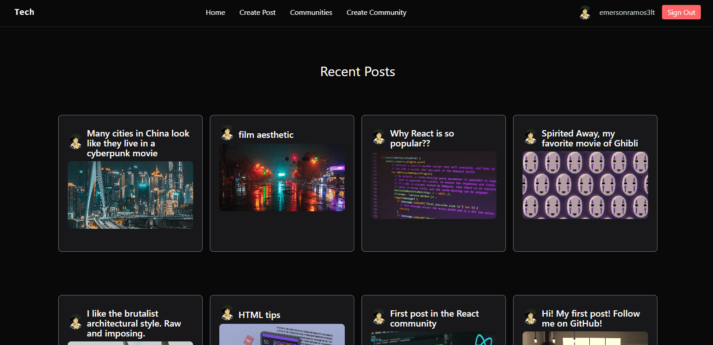
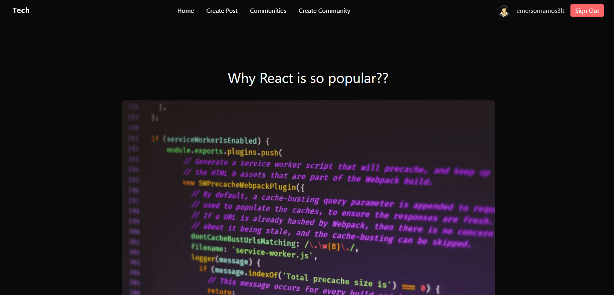
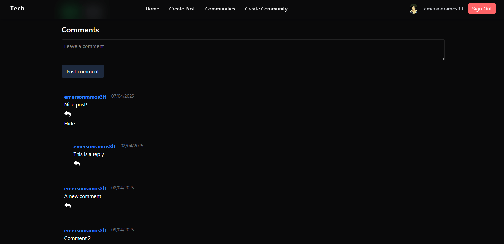

# **🌐 React Social Media App**

This project is a **React-based social media application** that provides users with an interactive platform to connect, share, and engage through posts and communities. The app features a **responsive and clean design**, built with a focus on **modern UI/UX best practices** for an intuitive user experience across all devices.

## **🔐 Authentication**
- Users can **log in securely via GitHub authentication**.
- Once authenticated, users gain full access to the app's social features.

## **Core Features**
- Create and publish posts.
- Build and manage custom communities.
- Like and comment on any post.
- Reply to other users' comments for seamless discussions.

## **⚙️ Technologies Used**
- **React** for the front-end UI.
- **React Hooks** like `useEffect` and `useState` for efficient state and side-effect management.
- **Mutations** to handle dynamic data changes in real-time.
- **Supabase** as the backend service, managing authentication, database interactions, and API operations.

## **Design Highlights**
- Fully **responsive layout**, optimized for mobile, tablet, and desktop.
- Follows modern **UI/UX principles** with clean, minimal styling for a smooth user experience.

This app blends powerful functionality with a sleek design, providing users with a dynamic and engaging social platform powered by modern web technologies.

## Project Screenshots

